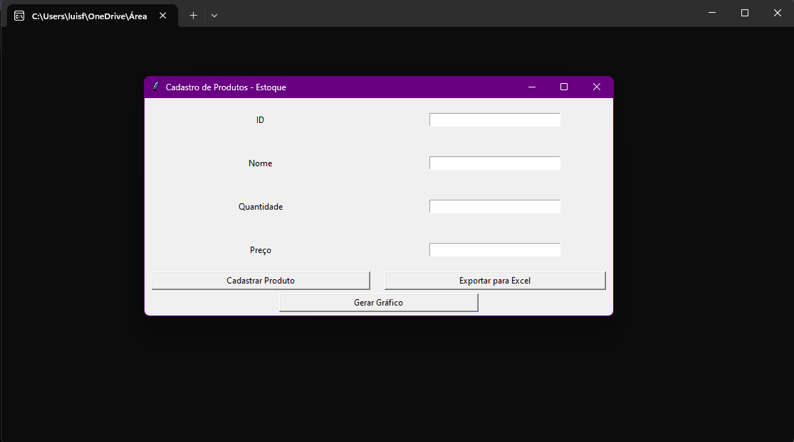
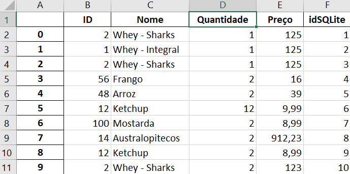
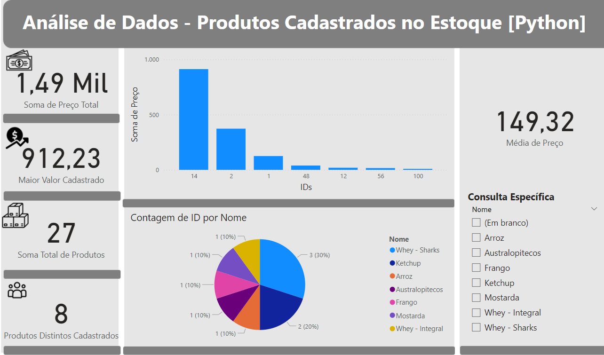

# Portfolio
Projeto realizado após concluir o curso "PYTHON 2024 - Sql, Power BI, Pandas, Numpy, Scikit" da Udemy, para trabalhar um pouco com cada ferramenta passada ao longo do curso.

 

 <figure>
  
  <figcaption>Interface feita utilizando python</figcaption>
 </figure>

 

 <figure>
   
  <figcaption>Dados cadastrados enviador para uma planilha excel</figcaption>
 </figure>

 

 <figure>
  
  <figcaption>Dashboard dos dados feita em powerBI</figcaption>
 </figure>

